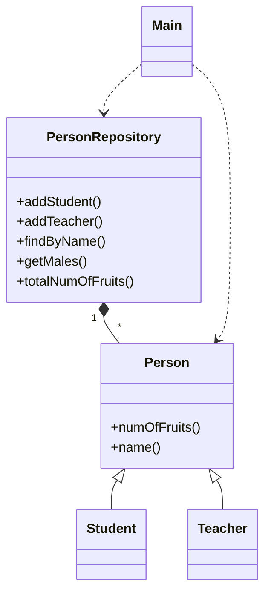

实习内容

- 目标
  - 学习Java、C++语言基础，并了解进一步学习的路线图
  - 了解相关编程思想
- Java和C++开发语言
  - Java核心技术、C++ Prime书籍导读
  - 库和主要数据结构
  - 两者异同
- 编程风格
  - 面向对象
    - 封装、继承、多态
  - 泛型
    - 模板函数、模板类
  - 函数式
    - filter、map、reduce
    - Reactive Functional Programming
- 多线程并发
  - thread
  - mutex
  - 条件变量
  - atomic
  - lockfree
- Git源代码管理工具的使用
- 进一步阅读推荐
  - 设计模式
    - 常见的面向对象设计方案
    - 核心思想：组合优于继承，code on interface
  - 重构
    - 在不改变行为的前提下改善代码设计
  - Effective Java、Effective C++系列
    - 写更好的、更工程化的代码

学习任务

|      | 任务安排                                                     | 说明                                                         |
| ---- | ------------------------------------------------------------ | ------------------------------------------------------------ |
| 1    | - 按目录确定各章节重要度、优先级 - 确定需学习的核心概念 | 最希望了解类的设计和应用 - 首先学习定义类的方式，参见任务2 - 良好设计来自于对问题本身深入理解，开发语言提供表达设计方案的选项 - 推荐了解UML最基础概念，并考虑如何把类图变成C++/Java实现 |
| 2    | - 类如何体现封装、继承和多态 - 析构、构造用途，move解决什么问题 - 如何表达interface概念？ - 虚函数概念和作用？ - Java在概念上是如何简化的？ | - 讨论: 构造析构管理资源RAII、shared_ptr引用计数和Java - 核心概念为主，零散知识点在碰到时说明 |
| 3    | - 使用C++ stl实现上述概念 - 使用Java Collection移植     | - 设计一个集合类，包含同学、教师概念 - 设计增删改查接口，包括如学生一个水果、教师2个水果，共需几个的虚函数实现  - 设计接口时请考虑参数和返回值传值、传引用的设计选择 |
| 4    | - 熟悉 <string> <vector> <algorithm><unordered_map>          | - 官网https://en.cppreference.com/                           |
| 5    | - 异常处理，如输入值的值域检查等                             | - <cassert>、<exception>的使用                               |
| 6    | - 使用Java Stream API改写上述实现                            |                                                              |
| 7    | - 熟悉Java Collection和C++容器                               | - 线性、树型、Hash表                                         |
| 8    | - 多线程                                                     | - 启动多个线程读写Collection，使用锁控制访问冲突             |
| 9    | - 理解同步、异步操作                                         |                                                              |
| 10   | - 基本UML图                                                  |                                                              |

步骤：

1. 充分理解需求
2. 设计类和类的关系，主要包括组合、聚合、继承、使用
3. 设计类的public函数接口，接口应简明、易用、高效
4. 实现类
5. 单元测试

C++函数参数和返回值

- int等基本类型传值
- 较大的类型传引用
- 一般使用const引用，除非该参数作为输入输出参数
- 值优先通过返回值返回，返回值一般是值类型，使用指针和引用时需确认指向内容的生命周期
- 如果需要返回多个值，可考虑std:;pair(两个)或std::tuple(多个)，或自定义结构和类

Java函数参数和返回值

- 基本类型传值，对象类型传指针（语法上类似C++的引用）
- 返回值也一样
- final Object o的final指的是o不能改变，o的内容还是可变

动态内存分配

| C++                          | Java                         |
| ---------------------------- | ---------------------------- |
| new在堆上分配                | new在堆上分配                |
| 一般地由创建者负责delete     | 垃圾收集器自动回收           |
| 需明确每处内存分配和使用情况 | 一般情况下依赖垃圾收集器即可 |

动态内存分配系统开销相对大，必要时的改善方案：

| C++                                          | Java               |
| -------------------------------------------- | ------------------ |
| 大多数应用无需改进                           | 大多数应用无需改进 |
| vector.reserve()一次性分配需要的量           | ??                 |
| vector容器的allocator                        | 没有对应机制       |
| 重载类或全局new、delete                      | 没有对应机制       |
| 自定义内存池，一次性分配很多自行分配回收管理 | 自定义内存池       |

集合类访问

| C++                 | Java                                      |
| ------------------- | ----------------------------------------- |
| 如std::vector       | 如ArrayList                               |
| for下标i            | for下标i                                  |
| range for           | range for，指for (Person p : people)      |
| 使用迭代器iterator  | Java的iterator概念不同，一般由于while语句 |
| 使用<algorithm>算法 | 使用Stream API                            |

函数式编程

| Java               | C++                   |
| ------------------ | --------------------- |
| Stream API         | <algorithm> <numeric> |
| filter             | std::copy_if          |
| map                | std::transform        |
| reduce             | std::accumulate       |
| any_of, every_of等 | 类似                  |

- C++ Callable
  - 函数
  - 函数的指针
  - 成员函数指针，Java的成员函数
  - std::bind
  - 重载()运算符
  - lambda，Java的lamda
  - std::function

多线程

| C++                                          | Java                                   |
| -------------------------------------------- | -------------------------------------- |
| **线程**                                     |                                        |
| <thread>                                     | java.lang.Thread类                     |
| 读是线程安全的，写不是                       | 同左                                   |
| 理解同步和异步操作的概念                     | 同左                                   |
| 总是按一定顺序加锁能避免死锁                 | 同左                                   |
| **加锁**，最常用机制                         |                                        |
| <mutex>                                      | 语言内置支持                           |
| std::lock_guard锁定临近区                    | synchronize关键字锁定临界区            |
| vector等容器不是线程安全的                   | java.util.concurrent包有线程安全集合类 |
| C++ 14新增读写锁，优化多线程读               | ?                                      |
| 不推荐使用spinlock                           | 不推荐使用                             |
| **条件变量**，除非明确需要否则慎用           |                                        |
| std::condition_variable                      | Object的wait()、notify()方法           |
| **原子操作**                                 |                                        |
| Compare And Swap概念                         | 同左                                   |
| <atomic>                                     | java.util.concurrent.atomic            |
| 不同数据类型支持的原子操作                   | 同左                                   |
| 了解Memory Model概念                         | 同左                                   |
| 了解lockfree概念，实现复杂一般不推荐自行实现 | 使用concurrent包，其实现是否lockfree?  |

同步、异步操作

- 同步操作：启动操作后，以blocking方式直到操作结束并返回操作结果
- 异步操作：启动操作后立即返回，操作结束后在工作线程调用回调函数通知操作结果
- 同步操作编程模型简单，相对而言性能差，单线程多个请求按顺序调用；异步并发性能好，但是编程模型复杂
- 同步和异步互转
  - 当集成第三方库时，由于接口是同步还是异步由第三方决定，故有时需同步/异步接口的转换
  - 同步转异步：将同步接口调用调度到线程池(如放入工作线程队列)后立即返回，同步操作完成后在工作线程上回调操作结果
  - 异步转同步：启动操作后使用条件变量wait，操作结束后在工作线程设置操作结果并notify

UML基本图

- 能看懂以下UML图，至少应能绘制序列图、类图
- 用例图：描述需求，说明”角色“通过系统的”操作“实现”业务目标“
- 序列图：说明子模块间如何协作完成业务用例，序列图强调的是子模块的外部动态特性
- 类图：说明子模块的内部静态结构
- 状态转换图：严格定义类的状态(成员变量取值)在接收到消息(public函数调用)后的转换关系

不同子类不同行为的实现方式

| C++                                 | Java                            |
| ----------------------------------- | ------------------------------- |
| 面向对象的虚函数                    | interface override              |
| 策略模式                            | 同左                            |
| 泛型编程的模板类                    | 同左                            |
| std::function<>，概念上类似策略模式 | 单函数订阅的FunctionalInterface |

